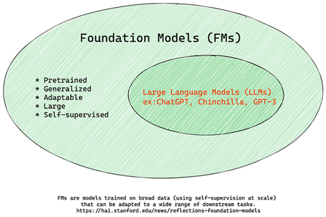
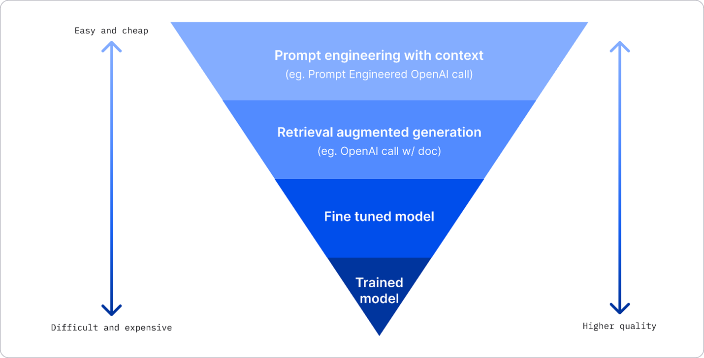

This folder contains pre-requisites for basic LLM Chatbot.

# Generative AI for Beginners
This talks about basics of what Gen AI is, the development of how it came onto being.
It talks about how llm works breifly.

# [1hr Talk] Intro to Large Language Models
- This video contains information on LLMs.
- How it is trained? What stages are there and how it is done (Pretraining, Finetuning)
- Scaling laws of LLMs
- How LLM OS (ecosystem) kind of looks?
- Importance of context windows
- How LLMs work? It's interaction with other tools
- Glimpse of RAGs
- 2 system of way of thinking of LLMs

## LLM Security
- Jailbreak of models 
    = Directly asking questions like how to make napalm won't work. But if context is provided in a roundabout
    way it provides the solution.
    GPT is fooled due to ROLEPLAY.
    = There are many types of jailbreak attacks
    = Another example is asking data in base encoding rather than full english.
- Prompt Injection attack
- Data poisioning / Backdoor attacks (Sleeper agent attack)
....and many more attacks

# Exploring and comparing different LLMs
This part contains following information:
- Different types of LLMs in the current landscape
- Testing, iterating, and comparing different models
- How to deploy LLM

## Different types of LLMs
- They can have multiple categorisation based on,

    - architecture
    - training data
    - usecase

- Understanding these differences will help select the right model for the scenario, and understand how to test, iterate, and improve performance.

### Text, audio, video, and image generation
- Audio and speech recognition: Whisper type models
- Image generation: DALL-E and Midjourney are two very well-known choices
- Text generation: GPT3.5 to GPT4
- Multi-modality: To handle multiple types of data in input and output with models like gpt-4 turbo with vision or gpt-4o which are capable to combine natural language processing to visual understanding, enabling interactions through multi-modal interfaces

- Selecting a model means you get some basic capabilities, that might not be enough however. Often you have company specific data that you somehow need to tell the LLM about. There are a few different choices on how to approach that, more on that in the upcoming sections.

### Foundation Models versus LLMs
The term Foundation Model as an AI model should follow some criteria, such as,
- They are trained using **unsupervised learning** or **self-supervised learning**, meaning they are trained on unlabelled multi-modal data, and they do not require human annotation or labelling of data for their training purpose.
- They are very large models, based on very deep neural networks trained on billion of parameters
- They are normally intended to serve as a `foundation` for other models, meaning they can be used as a starting point for other models to be built on top of, which can be done by fine tuning.

    

### Embedding versus Image generation versus Text and Code generation
- LLMs can also be categorized by the output they generate.
- Embeddings are set of model used to convert text to numerical forms called embeddings
- Image generation models are models that generate images. These models are often used for image editing, image synthesis, and image translation
- Image generation models are often trained on large datasets of images
- It can be used to generate new images or to edit existing images with inpainting, super-resolution, and colorization techniques
- Text and code generation models are models that generate text or code. These models are often used for text summarization, translation, and question answering
- Text generation models are often trained on large datasets of text, such as BookCorpus, and can be used to generate new text, or to answer questions
- Code generation models, like CodeParrot, are often trained on large datasets of code, such as GitHub, and can be used to generate new code, or to fix bugs in existing code.

### Encoder-Decoder versus Decoder-only

### Service versus Model
- A service is a product that is offered by a Cloud Service Provider, and is often a combination of models, data, and other components. 
- A model is the core component of a service, and is often a foundation model, such as an LLM.
- Services are often optimized for production use and are often easier to use than models, via a graphical user interface. 
- However, services are not always available for free, and may require a subscription or payment to use, in exchange for leveraging the service owner's equipment and resources, optimizing expenses and scaling easily
- Models are just the Neural Network, with the parameters, weights, and others. Allowing companies to run locally, however, would need to buy equipment, build a structure to scale and buy a license or use an open-source model. 
- A model like LLaMA is available to be used, requiring computational power to run the model.

## How to test and iterate with different models to understand performance on Azure
- Once team has explored the current LLMs landscape and identified some good candidates for their scenarios, the next step is testing them on their data and on their workload
- Find the Foundation Model of interest in the catalog - either proprietary or open source, filtering by task, license, or name
- Review the model card, including a detailed description of intended use and training data, code samples and evaluation results on the internal evaluations library
- Compare benchmarks across models and datasets available in the industry to assess which one meets the business scenario
- Fine-tune the model on custom training data to improve model performance in a specific workload
- Deploy the original pre-trained model or the fine-tuned version to a remote real time inference - managed compute - or serverless api endpoint

## Improving LLM results

- One  can select different types of models with different degrees of training when deploying an LLM in production, with different levels of complexity, cost, and quality. Here are some different approaches:

    - **Prompt engineering with context**. The idea is to provide enough context when you prompt to ensure you get the responses you need.
    - **Retrieval Augmented Generation, RAG**. Your data might exist in a database or web endpoint for example, to ensure this data, or a subset of it, is included at the time of prompting, you can fetch the relevant data and make that part of the user's prompt.
    - **Fine-tuned model**. Here, you trained the model further on your own data which led to the model being more exact and responsive to your needs but might be costly.

### Prompt Engineering with Context
- Pre-trained LLMs work very well on generalized natural language tasks, even by calling them with a short prompt, like a sentence to complete or a question – the so-called “zero-shot” learning
- However, the more the user can frame their query, with a detailed request and examples – the **Context** – the more accurate and closest to user's expectations the answer will be. 
- In this case, we talk about “one-shot” learning if the prompt includes only one example and “few shot learning” if it includes multiple examples. 
- Prompt engineering with context is the most cost-effective approach to kick-off with.

### Retrieval Augmented Generation (RAG)
- LLMs have the limitation that they can use only the data that has been used during their training to generate an answer. 
- This means that they don't know anything about the facts that happened after their training process, and they cannot access non-public information (like company data). 
- This can be overcome through RAG, a technique that augments prompt with external data in the form of chunks of documents, considering prompt length limits. 
- This is supported by Vector database tools that retrieve the useful chunks from varied pre-defined data sources and add them to the prompt Context.
- This technique is very helpful when a business doesn't have enough data, enough time, or resources to fine-tune an LLM, but still wishes to improve performance on a specific workload and reduce risks of fabrications, i.e., mystification of reality or harmful content.

### Fine-tuned model
- Fine-tuning is a process that leverages transfer learning to ‘adapt' the model to a downstream task or to solve a specific problem. 
- Differently from few-shot learning and RAG, it results in a new model being generated, with updated weights and biases. 
- It requires a set of training examples consisting of a single input (the prompt) and its associated output (the completion). This would be the preferred approach if:

    - **Using fine-tuned models.** A business would like to use fine-tuned less capable models (like embedding models) rather than high performance models, resulting in a more cost effective and fast solution.
    - **Considering latency.** Latency is important for a specific use-case, so it's not possible to use very long prompts or the number of examples that should be learned from the model doesn't fit with the prompt length limit.
    - **Staying up to date.** A business has a lot of high-quality data and ground truth labels and the resources required to maintain this data up to date over time.

### Trained model
- Training an LLM from scratch is without a doubt the most difficult and the most complex approach to adopt, requiring massive amounts of data, skilled resources, and appropriate computational power. 
- This option should be considered only in a scenario where a business has a domain-specific use case and a large amount of domain-centric data.
